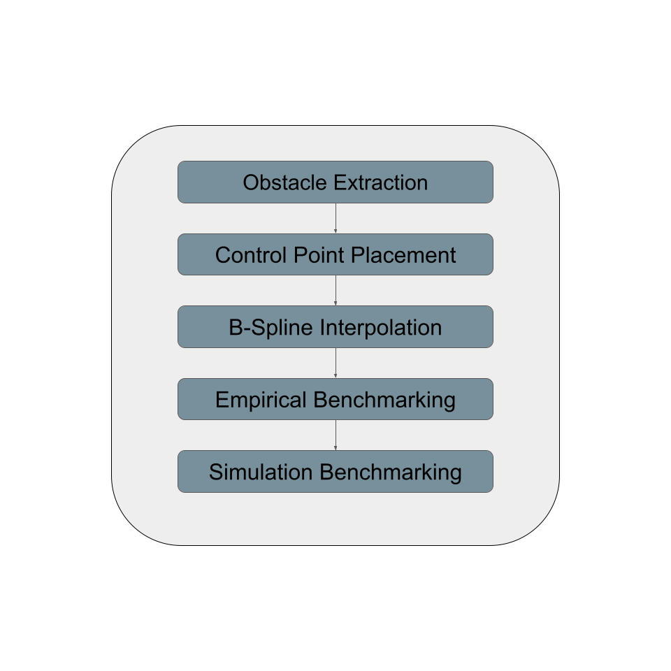
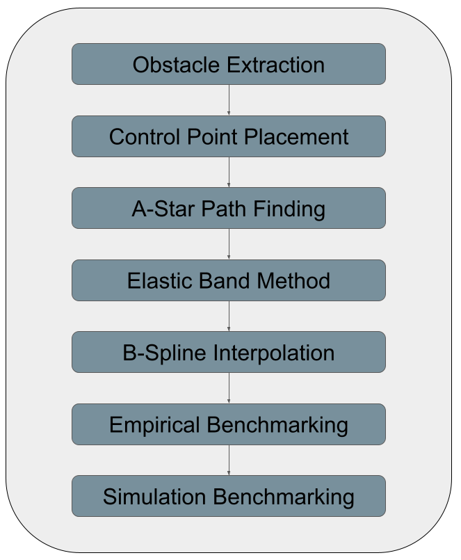

# Drone Path Planning and Control Project

## Overview
This project implements advanced path planning with a B-spline trajectory optimization tool
and an autonomous drone control system using the Crazyflie platform in the Webots simulator.

## Links
The project overleaf project can be viewed here: https://www.overleaf.com/read/zxcdcdgqcrsz#d50844
The simulation documentation can be viewed here: https://micro-502.readthedocs.io/en/latest/
Webots con be downloaded here: https://www.cyberbotics.com/

## Key Features
- 3D path planning with obstacle avoidance features
- RubberBand smoothing
- B-spline path optimization
- Path benchmarking and analysis
- Support for both obstacle and obstacle-free environments
- Simulation in Webots

## Project Structure
```
DISAL_Drone_Project/
├── epfl_code/
│   ├── controllers/
│   │   └── main/
│   │       └── assignment/
│   │           └── my_assignment.py       # Main control implementation
│   ├── utils/
│   │   ├── astar3D.py                     # 3D path planning algorithm
│   │   ├── benchmark.py                   # Path evaluation tools
│   │   ├── extractWorldData.py            # World data parsing
│   │   ├── occupancyMap.py                # 3D environment mapping
│   │   ├── rubberBand.py                  # Path smoothing
│   │   ├── smoother.py                    # B-spline path optimization
│   │   └── visualize3D.py                 # 3D visualization tools
│   └── worlds/                            # Webots world files
├── src/
│   └── create_map.ipynb                   # Path planning playground
└── requirements.txt                       # Python dependencies
```

## Setup and Installation

1. Install dependencies:
2. Required packages: (see requirements.txt)
```
numpy~=2.2.5
matplotlib~=3.10.1
opencv-python~=4.11.0.86
pandas~=2.2.3
pillow~=11.2.1
scipy~=1.15.2
plotly~=6.0.1
```
3. Follow the Instructions on the [Webots website](https://www.cyberbotics.com/doc/guide/installation-procedure) to install Webots
4. Follow the Instructions on the [Webots website](https://www.cyberbotics.com/doc/guide/running-extern-robot-controllers) to link Webots with your IDE of choice.
## Usage

### Path Planning (create_map.ipynb)
1. Open `create_map.ipynb` in Jupyter Notebook
2. Set the `world_path` variable to your desired Webots world file
3. Run the cells sequentially to:
   - Extract world data
   - Generate occupancy maps
   - Create optimized paths
   - Benchmark path quality

### Simulation (Webots)
1. Open the appropriate world file in Webots:
   - `worlds/crazyflie_world_assignment.wbt` (with obstacles)
   - `worlds/crazyflie_world_empty.wbt` (without obstacles)
2. The controller in `controllers/main/assignment/my_assignment.py` will handle drone control

1. **World Data Extraction**: Parse obstacle and control point data
2. **Occupancy Mapping**: Create 3D grid representation
3. **Path Planning**: Generate initial path using A* algorithm
4. **Path Optimization**:
   - RubberBand smoothing
   - B-spline interpolation
   - Obstacle avoidance refinement
5. **Benchmarking**:
   - Path length
   - Minimum clearance
   - Maximum curvature
   - Maximum snap, jerk, acceleration, and velocity
   - Path smoothness

## Example Hyperparameters

### Table: Hyperparameters for Path Generation (With vs. Without Obstacles)

| **Variable**                    | **No Obstacles** | **With Obstacles** |
|----------------------------------|------------------|---------------------|
| Resolution                       | 0.05 meters      | 0.05 meters         |
| A-star Safety Margin             | 2 Voxels         | 2 Voxels            |
| Elastic Band Tension             | 0.8              | 0.6                 |
| Elastic Band Repulsion           | 2                | 3                   |
| Elastic Band Damping             | 0.12             | 0.08                |
| Elastic Band Neighborhood        | 4 Voxels         | 4 Voxels            |
| Elastic Band Iterations          | 200              | 200                 |
| B-spline Degree                  | 3 and 4          | 3 and 4             |
| B-spline Downsample              | 1                | 30                  |
| B-spline Boundary Constraints    | "Not-a-Knot"     | "Not-a-Knot"        |

## Pipeline Without Obstacles


## Pipeline With Obstacles



## Documentation
For detailed information about using the simulator and understanding the implementation, visit:
https://micro-502.readthedocs.io

## Contributing
This projct is open source and contributions are welcome. However work is not continuing and this project is closed.

## Aknowlegments 
Thank you to Alexander Kiessling for his supervision duing this project.
Thank you to the EPFL DISAL Lab for the opportunity to work on this project.

## License
MIT License
